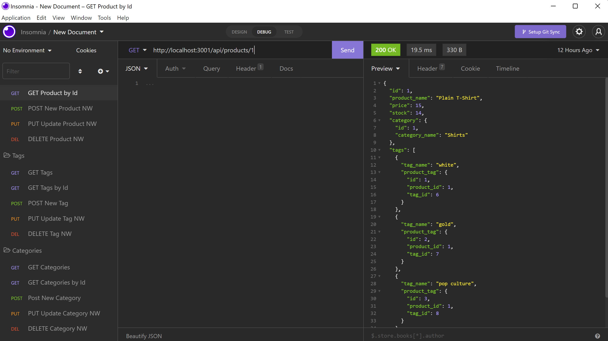

# E-Commerce Backend

## Objective
The objective of this assignment was to create a functioning back end for an e-commerce brand using node.js, sequelize, and express where the e-commerce owner would be able to view, add, update, and delete products, catergories, and tags.

## Approach
My approach as usual, was to watch some videos to try and understand what to do. I drew out what the requirements asked, set up my files, and then looked at what code was given. I determined that I needed to input code into the models and routes folders, as well as bring in sequelize to the server.js file.

## End Result
This was a hard assignment. I had trouble even understanding what I was doing half the time with the routes. The end result is unfinished and something to come back to in the future.

## Reflection
Following reflection upon handing this assignment in, I realize that I am not registering back-end that well. There's a lot more studying that needs to go into this but not enough time. It's very discouraging not being able to finish this assignment and the last few.

## Final Product
[Video Link](https://drive.google.com/file/d/1mj-czG9is8FGnDlybyi9uRmTBoNbsRGD/view)
[GitHub Repository](https://github.com/jessicamdittrich/CHG-JD062422)
